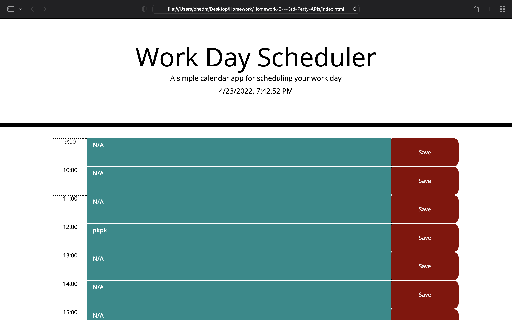

Homework 5 - Day Planner - 3rd Party APIs

Criteria:

Create a Daily Planner, that with the following:
- Display Current Time Clock - Day/Time
- Editable Time Blocks to add Upcoming/Previous Tasks
- Color code Time Blocks depending on the Time (Past, Present, Future)
- Functional "Save Button" in order to save Tasks
- Display Saved Tasks(pulled from localstorage)

Github Links:
Repository: https://github.com/phwang93/Homework-5-3rd-Party-APIs
Deployed Html: https://phwang93.github.io/Homework-5-3rd-Party-APIs

Site Preview:

